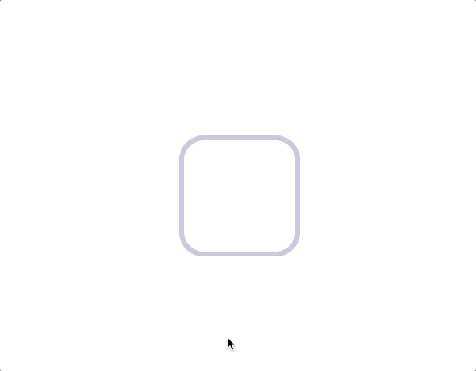

# UXE Checkbox Challenge React  Component



## API
| Prop  | Type | Description |
| ------------- | ------------- | ------------- |
| isChecked  | `Boolean`  | Value of the checkbox |
| onChange  | `Function` | Change handler function. It's useful for changing the state of checkbox |

## Example
```javascript
import React, { useState } from "react";
import "./App.css";

import Checkbox from "./Checkbox";

function App() {
  const [isChecked, setChecked] = useState(false);
  const toggleCheck = () => {
    setChecked(!isChecked);
  }
  return (
    <Checkbox
      isChecked={isChecked}
      onChange={toggleCheck}
    />
  );
}

export default App;
```

## Codepen
Here's [demo on CodePen!](https://codepen.io/KiarashZ/pen/zYxNxEe)
